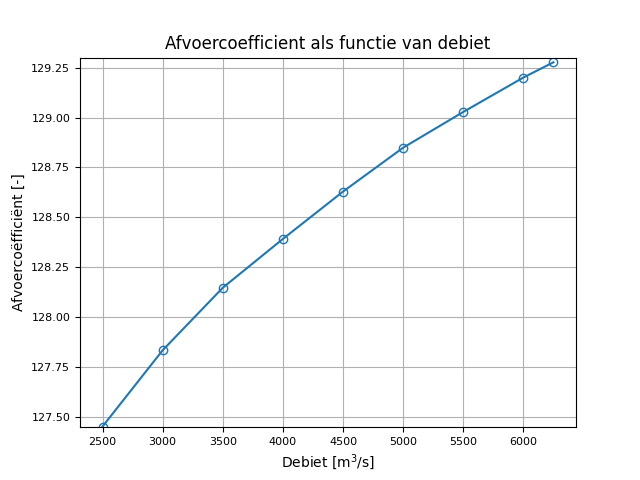
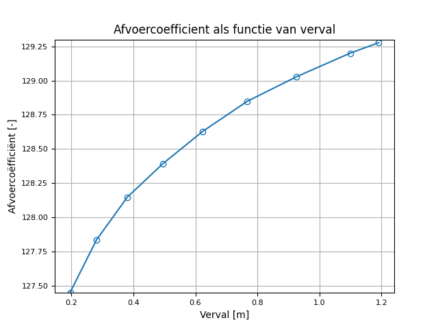
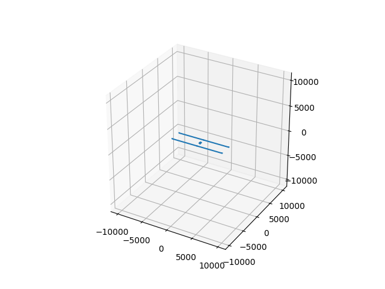
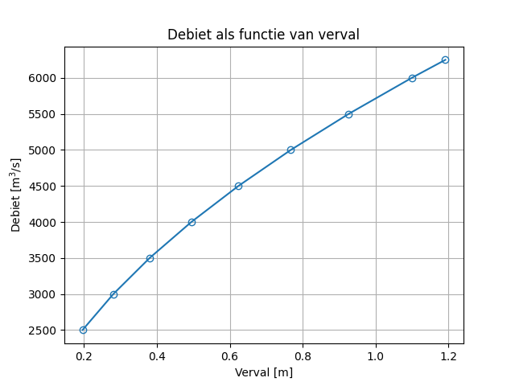
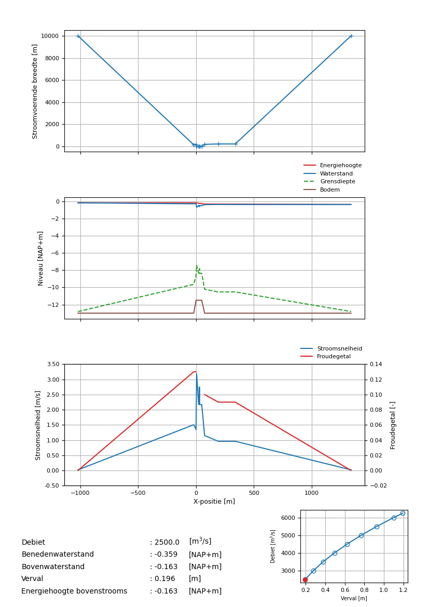

.. |br| raw:: html

    

.. _gebruik:

Gebruik
========

Benodigde gegevens
------------------
De invoer van het programma SPUIS bestaat uit de geometrie van de stroomvoerende dwarsprofielen, schuifstanden, de ruwheid van bodem en wanden, het debiet en de benedenwaterstand (of soms de bovenwaterstand). Contracties bij schuiven en andere profielvernauwingen en het stroombeeld bij verwijdingen moeten worden opgegeven (het programma berekent dit niet!). Ervaring en inzicht zijn vereist om dit programma met succes te kunnen gebruiken.

Werkwijze
---------
Het programma kan gedraaid worden met behulp van de :py:func:`runSpuis` of de gegenereerd executable. De invoer-file heet bijvoorbeeld ``example.in``. Er worden na het uitvoeren drie uitvoerfiles gemaakt: ``example.uin``, ``example.uqh`` en ``example.uws``.
Door editing van de beschikbare invoer-file kan een nieuwe invoer-file worden gemaakt. Achter iedere invoerregel staat een toelichting.
Met gebruikmaking van de uitvoer-file ``example.uws`` kunnen TEKAL plotjes worden gemaakt. Dit wordt gedaan in het postprocessin gedeelte in :py:func:`runSpuis`.

.. _invoer:

Invoer
------
Hieronder wordt van SPUIS401 een voorbeeld-invoerbestand getoond. De file eindigt op '.in'.

file: ``example.in``

.. literalinclude:: example/example.in

Run
---
Het uitvoeren van de simulatie kan gedaan worden met :py:func:`runSpuis`. Hiervoor is Python nodig. Deze roept de executable aan in ./SPUI401/ aan genaamd ``SPUIS401.exe``. Deze is gecompileerd met ``EXE.py`` op basis van de functies gegeven in ./SPUIS401/py. De executable of :py:func:`SPUIS401` kan ook onafhankelijk gebruikt worden wanneer ervaring is met Python.

Het uitvoeren van Python kan op meerdere manieren. Dit kan door middel van software als *Spyder* en *Pycharm*, maar ook zonder deze software door Python direct te installeren.
Het is belangrijk dat Python3 is geinstalleerd. Wanneer de 'path' is toegevoegd aan de Windows environmental variables naar de Python executable, kan de code gedraaid worden door middel van de volgende commando in te vullen in de Windows command window:

.. code-block:: console

	python3 runSpuis.py

Wanneer de python script is gerund, worden er voor de berekeningen twee vragen gesteld: 
De eerste vraag betreft of de postprocessing in :ref:`post` opgeslagen moet worden.
De tweede vraag vraagt of er een hele folder of alleen 1 input file uitgevoerd moet worden.
Hierna opent een venster waarin gekozen kan worden voor de locatie.
Beide vragen kunnen beantwoord worden in de command window met ja (y) of nee (n).

Nadat de vragen zijn beantwoord, werkt de simulatie. Als deze zijn uitgevoerd, wordt er gevraagd naar de referentie oppervlak van de sluis.
Deze is nodig om de afname coefficient uit te rekenen. Na de vraag is beantwoord, wordt de postprocessing uitgevoerd en eindigt het script.
 
.. _uitvoer:

Uitvoer
-------
Hieronder wordt de uitvoer gegeven van het voorbeeld ``example.in`` gegeven boven in :ref:`invoer`. 
De uitvoer bestaat uit de volgende documenten: ``example.uin``, ``example.uqh`` en ``example.uws``.
De uitvoerbestanden worden hier 1 voor 1 weergegeven. Deze worden gegenereerd bij de executable.

file: ``example.uin``

.. literalinclude:: example/example.uin

file: ``example.uqh``

.. literalinclude:: example/example.uqh

file: ``example.uws``

.. literalinclude:: example/example.uws

.. _post:

Postprocessing
--------------
De huidige versie van :py:func:`runSpuis` gebruikt de resultaten in :ref:`uitvoer` om figuren te maken.
Deze zijn beneden geillustreerd. Uiteindelijk wordt er een samenvatting gemaakt voor elke run-case, zie :ref:`postprc`.

   
   De geometry van de spuisluis ingevoerd in ``example.in``.

   
   This is the caption

.. _postprc:

   Voorbeeld van resultaten RUN 1 met gegeven debiet.